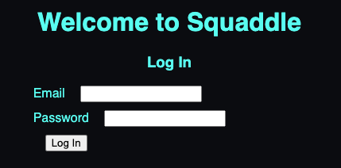
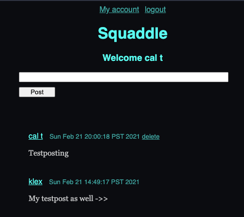
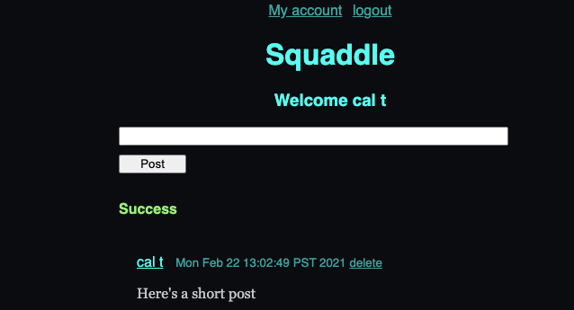

# Squaddle
###### (working title)

Squaddle is a proof-of-concept micro-blogging app I made while learning the Play framework for Java & Scala.

#### Play with JSON storage

I was particularly happy with Play's use of FasterXML's Jackson library, which handles JSON for Java. Writing `User user` into plain JSON is killer; instantiating `user` again in a single step is even better.

#### My favorite little method

My part of Squaddle is a static method in `IOdevice` called `getNode()`. It takes 3 `String` params: `fileDir`, `key`, & `value`. We assume unique k/v pairs. The method searches the directory provided for `.json` files containing the k/v pair specified, and returns the right one as a JsonNode. This single method let me grab any stored JSON file so the calling class could instantiate it. One method to return them all, and, agnostically, bind them.

#### The Squaddle flow

You've got all the basics of a social media platform in the making.

##### Log in

##### Homepage

##### Posting capability

##### And a basic account page

If I was going to continue, my next steps would be:
- Password hashing
- Password recovery flow using email
- Inserting links and media in Posts
- Post replies
- Friend connections

Thanks for reading!
